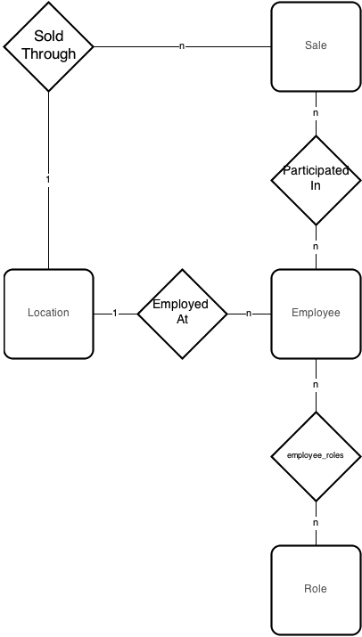

Design Document
===============

The majority of this project has been developed on unix/linux machines.

## Purpose of Project

The system is designed for use by a company with multiple locations. The database will maintain a tracking of employee earnings throughout the entire company. Such a database is necessary due to poor data management by other systems that the company has previously used. Employee earnings will be efficiently tracked based on multiple attributes including but not limited to: name, actualized earnings, and location. By using this system, a company will have unparalleled precision when reviewing earning reports despite a heavy influx of reports due to their large number of locations.

## High Level Entities

### DBMS 

Each of the four major components of the DB Engine comprise the high level overview and will be discussed in the following section. They will be discussed in the order in which a typical query will be processed. The DML Interface module will handle the interface between the DB Engine and the DB App. The Core Engine module's task is to interpret whether it has received a valid input, think of the Core Engine as a traffic cop. The Parser module's job is to take input and determine the grammar used and what the arguments are.  The File I/O module is where the table script files are organized and stored. 

### DB App

The database app itself will facilitate querying the database for pertinent information about sales.

### Database

One location has many earning reports submitted for it. Many employees are employed at one location. Many employees participate in many sales, and these sales are all run through one location. Finally, many employees have many different roles in the company.

## Low Level Design

### DBMS

#### DML Interface
This is the first of four major modules that make up the DBMS engine. This focus in the design of this module is to implement an interface for query through the DB App as well as a way to directly interact with the database itself. Therefore its main function is to provide a way to request and format input and output to and from the user. From the DML Interface the query is passed into the Core Engine.

#### Core Engine
This module's purpose is to process requests and determine whether the next step is to send that information to the Parser Module, File I/O or return results to the DML Interface. It will manage the database relations that have been loaded into memory and do operations on them.

#### Parser
This process will result in values that the Core Engine can then use to determine what and where the results for the query are. A recursive descent parser will be used to parse the input statements according to the given grammar.

#### File I/O
This is the fourth major module in the DBMS engine. The focus in the design of this module is to provide a way to interact with the ASCII files which house the commands to generate the various tables and reports. Specific design considerations include portability and simplicity. This module knows where the ASCII files are located that have the appropriate relations. The files are executed as scripts and the results are then handed back to the Core Engine, and then back to the DML Interface.

### Database App

### User I/O
A command line based menu system has been created to allow employees to manage sale data in the system through an intuitive interface. We have chosen to focus on the sales aspect of the implementation. This decision was made after the design phase had concluded. The reason for this was that the focus of the program became its use by sales personnel and as such they would not need access or the ability to edit certain aspects of the Database.

### Business Logic
This process will compute earnings totals and carry out other calculations based on the data in the database.

### DBMS
See above.

## Benefits, Assumptions, and Risks

### Benefits

A major foreseen benefit is simplicity. We will be implementing the DBMS by making use of relational algebra instead of more complicated and robust systems. By using relational algebra we also avoid the possibility of NULL values and duplicated tuples. This is a huge simplification when considering the table structure and overall code design. The assumption is that there are only six primitives which does yield a simpler code design, but queries will be more strict and verbose. This trade off is necessary in order to be able to produce the project in the desired timeline. 

An additional benefit is the implementation of the vector of vectors data structure to be used for generating tables (Relations). This will allow the DB engine to expand and traverse the relation space much more easily. The assumption is that we can store the attribute list in an array due to the fact that we will need to manipulate existing attributes but not add or remove them. A static storage structure such as an array will fit this design consideration most effectively. 

Another benefit is that the relations are stored in plain ASCII text files. This is great due to portability issues and formatting. This is yet another layer of simplicity that will lend itself to be not only human readable (not binary or machine code), but also capable of being transported or run from various platforms.

By programming the project in C++, we can avoid some of the headaches associated with lower-level programming.

A direct benefit would also be seen by our hypothetical customer. They would be able to manage their sales data much more effectively with our application.

### Assumptions

The interface for the database app will be a command line interface. The benefit is that this will allow for increased flexibility across platforms and simplicity. Although this requires a higher level of understanding of the system in order to work with, the highly expanded file and data access over a GUI (Graphical User Interface) provides a distinct benefit in this situation.

### Risks

Implementing a DBMS system in general can be quite expensive and time consuming to design and implement a DBMS system especially if dealing with large projects. As a database size increases, the resource load will increase over time, and the risk of data corruption will be greater and more difficult to trace.

A second risk would be complexity. DBMS are complex pieces of software that use highly intricate algorithms developed over decades as noted in the project description. Of course, in this project we will be simplifying so this will not be as great of a concern, but there will still be a cost related to time and knowledge constraints.

Risks of the DB App would include user input. Since we will be using command line interface, the user could accidentally press random keys and symbols so error catching is essential. The chance of a faulty user command or query that slips through the safeguards could potentially cause corruption within the engine as well as corruption of data. With such a risk, a high level of input safeguards and controls are necessary to put into place.

## Post-Production Notes

### Design Considerations

As discussed in the previous section dealing with the Database Application, the decision was made to focus on the implementation from a sales personnel perspective. The ability for the sales team to add, edit and review the sales table is critical for their mission to be successful. This was taken in to account when deciding how to implement certain functions which authorize the manipulation of database entries. Therefore, the only entries that are able to edited and manipulated are in the sales table. This ultimately implies that the location, employee, and role tables will not be modified as the sales personnel will not be hiring or promoting new employees nor are they authorized to implement changes to personnel in terms of where they work or which location is considered to be their home branch.

### Work Load Distribution

The work loads were very fluid amongst the group member with the exception of Travis who consistently delegated sub-projects and reviewed submitted code. Shane brought some great perspective and work arounds for his own, John's and Adam's portions of each major update. John contributed consistently on documentation and worked on the Database Engine and Database Application's menu system with Shane and Adam. Adam provided great input on various aspects of the projects delegated down by Travis. Overall, the group seemed to share enthusiasm and interest in the project.

Travis	:	73.70%

Shane	:	11.90%

John	:	12.66%

Adam	:	1.74%

These percentages are taken from total contributions on our teams Git Repository. Total commits are 6368 (both + and -). Percentage is taken from the individuals total commits divided by the groups total commits.

### Development Log

In order to see the development log for this project, follow the link:

https://github.com/travisolbrich/315-P1-DBMS
