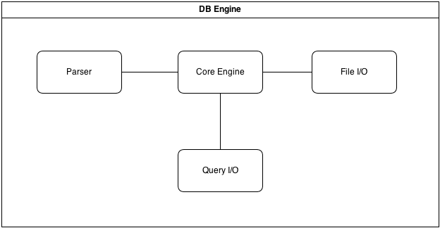
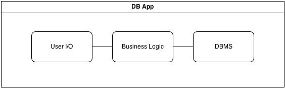

Design Document
===============

## Purpose of Project

For the Database Management System, the system is designed for use by a heavily enfranchised restaurant chain. The database will maintain a tracking of employee earnings throughout the entire company, keeping all of the varied branches in consideration. Such a database is necessary due to poor data management by other systems that the company has previously used. Employee earnings will be efficiently tracked based on multiple attributes including but not limited to: name, actualized earnings, city, and branch. These attributes will then be related so as to transgress to a more focused attribute pool. By using this system, a company will have unparalleled precision when reviewing earning reports despite a heavy influx due to their large franchise numbers.

## High Level Entities

### DBMS 

Each of the four major components of the DB Engine comprise the high level overview and will be discussed in the following section. They will be discussed in the order in which a typical query will be processed. The DML Interface module will handle the interface between the DB Engine and the the DB App. Its main function is to provide a way to request and format input and output to and from the user. From the DML Interface the query is passed into the Core Engine. This module's task is to interpret whether it has received a valid request and whether the next step is to send that information to the Parser Module, File I/O or return results to the DML Interface. Think of the Core Engine as a traffic cop. The Parser module's job is to take input and determine the grammar used and what the arguments are. This process will result in values that the Core Engine can then use to determine what and where the results for the query are. The File I/O module is where the table script files are organized and stored. This module knows where the ASCII files are located that have the appropriate relations. The files are executed as scripts and the results are then handed back to the Core Engine.

### DB App

## Low Level Design

### DBMS

#### Entity 1

#### Entity 2

### DB App

#### Entity 1

#### Entity 2

## Benefits, Assumptions, and Risks
A major foreseen benefit is simplicity. We will be implementing the DBMS by making use of relational algebra instead of more complicated and robust systems. By using relational algebra we also avoid the possibility of NULL values and duplicated tuples. This is a huge simplification when considering the table structure and overall code design. The assumption is that there are only six primitives which does yield a simpler code design, but queries will be more strict and verbose. This trade off is necessary in order to be able to produce the project in the desired timeline. As mentioned above we will be using six primitives. Listed below are the six and their functional description. (These descriptions are found in the project description under the Relational Algebra section)

Selection: select the tuples in a relation that satisfy a particular condition.

Projection: select a subset of the attributes in a relation.

Renaming: rename the attributes in a relation.

Set union: compute the union of two relations; the relations must be union-compatible.

Set difference: compute the set difference of two relations; the relations must be union-compatible.

Cross product: compute the Cartesian product of two relations.

An additional benefit is the implementation of the vector of vectors data structure to be used for generating tables (Relations). This will allow the DB engine to expand and traverse the relation space much more easily. The assumption is that we can store the attribute list in an array due to the fact that we will need to manipulate existing attributes but not add or remove them. A static storage structure such as an array will fit this design consideration most effectively. 

Another benefit is that the relations are stored in plain ASCII text files. This is great due to portability issues and formatting. This is yet another layer of simplicity that will lend itself to be not only human readable (not binary or machine code), but also capable of being transported or run from various platforms.

For the DB App the assumption is that the interface will be implemented by way of CLI (Command Line Interface). The benefit is that this will allow for increased flexibility across platforms and simplicity. Although this requires a higher level of understanding of the system in order to work with, the highly expanded file and data access over a GUI (Graphical User Interface) provides a distinct benefit in this situation. As well as giving far greater speed to the user as the system runs at a much lower level.

Being able to layer the DB App directly on top of the engine will be a benefit due to how tightly the interface can be implemented for queries. 
