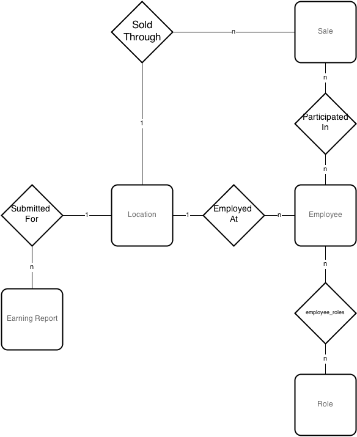

Design Document
===============

## Purpose of Project

The system is designed for use by a company with multiple locations. The database will maintain a tracking of employee earnings throughout the entire company. Such a database is necessary due to poor data management by other systems that the company has previously used. Employee earnings will be efficiently tracked based on multiple attributes including but not limited to: name, actualized earnings, and location. By using this system, a company will have unparalleled precision when reviewing earning reports despite a heavy influx of reports due to their large number of locations.

## High Level Entities

### DBMS 

Each of the four major components of the DB Engine comprise the high level overview and will be discussed in the following section. They will be discussed in the order in which a typical query will be processed. The DML Interface module will handle the interface between the DB Engine and the DB App. The Core Engine module's task is to interpret whether it has received a valid input, think of the Core Engine as a traffic cop. The Parser module's job is to take input and determine the grammar used and what the arguments are.  The File I/O module is where the table script files are organized and stored. 

### DB App

The database app itself will facilitate querying the database for pertinent information about sales.

### Database

One location has many earning reports submitted for it. Many employees are employed at one location. Many employees participate in many sales, and these sales are all run through one location. Finally, many employees have many different roles in the company.

## Low Level Design

### DBMS

#### DML Interface
This is the first of four major modules that make up the DBMS engine. This focus in the design of this module is to implement an inteface for query through the DB App as well as a way to directly interact with the database itself. Therefore its main function is to provide a way to request and format input and output to and from the user. From the DML Interface the query is passed into the Core Engine.

#### Core Engine
This module's purpose is to process requests and determine whether the next step is to send that information to the Parser Module, File I/O or return results to the DML Interface.

#### Parser
This process will result in values that the Core Engine can then use to determine what and where the results for the query are.

#### File I/O
This is the fourth major module in the DBMS engine. The focus in the design of this module is to provide a way to interact with the ASCII files which house the commands to generate the various tables and reports. Specific design considerations include portability and simplicity. This module knows where the ASCII files are located that have the appropriate relations. The files are executed as scripts and the results are then handed back to the Core Engine, and then back to the DML Interface.

## Benefits, Assumptions, and Risks
A major foreseen benefit is simplicity. We will be implementing the DBMS by making use of relational algebra instead of more complicated and robust systems. By using relational algebra we also avoid the possibility of NULL values and duplicated tuples. This is a huge simplification when considering the table structure and overall code design. The assumption is that there are only six primitives which does yield a simpler code design, but queries will be more strict and verbose. This trade off is necessary in order to be able to produce the project in the desired timeline. As mentioned above we will be using six primitives. Listed below are the six and their functional description. (These descriptions are found in the project description under the Relational Algebra section)

 * Selection: select the tuples in a relation that satisfy a particular condition.

 * Projection: select a subset of the attributes in a relation.

 * Renaming: rename the attributes in a relation.

 * Set union: compute the union of two relations; the relations must be union-compatible.

 * Set difference: compute the set difference of two relations; the relations must be union-compatible.

 * Cross product: compute the Cartesian product of two relations.

An additional benefit is the implementation of the vector of vectors data structure to be used for generating tables (Relations). This will allow the DB engine to expand and traverse the relation space much more easily. The assumption is that we can store the attribute list in an array due to the fact that we will need to manipulate existing attributes but not add or remove them. A static storage structure such as an array will fit this design consideration most effectively. 

Another benefit is that the relations are stored in plain ASCII text files. This is great due to portability issues and formatting. This is yet another layer of simplicity that will lend itself to be not only human readable (not binary or machine code), but also capable of being transported or run from various platforms.

For the DB App the assumption is that the interface will be implemented by way of CLI (Command Line Interface). The benefit is that this will allow for increased flexibility across platforms and simplicity. Although this requires a higher level of understanding of the system in order to work with, the highly expanded file and data access over a GUI (Graphical User Interface) provides a distinct benefit in this situation. As well as giving far greater speed to the user as the system runs at a much lower level.

Being able to layer the DB App directly on top of the engine will be a benefit due to how tightly the interface can be implemented for queries. 

The risks involved are discussed in the following paragraphs.

Implementing a DBMS system in general can be quite expensive and time consuming to design and implement a DBMS system especially if dealing with large projects. As a database size increases, the resource load will increase over time, and the risk of data corruption will be greater and more difficult to trace.

A second risk would be complexity. DBMS are complex pieces of software that use highly intricate algorithms developed over decades as noted in the project description. Of course, in this project we will be simplifying so this will not be as great of a concern, but there will still be a cost related to time and knowledge constraints.

A third risk would be integrity. Because of many users having access to the same data at the same time, there is a moderate level of threat to data integrity, requiring mechanisms to ensure the safety of data. Any damage to the DBMS system will be reflected to all files and application programs within. Hand-in-hand with integrity is system security. Security is an extremely important aspect to any DB engine, especially those concerning sensitive data. In a DBMS system, users have access to all the files, not just a few and so if an unauthorized users were to infiltrate the DBMS system, it could pose privacy threats. Since we will be using vectors and arrays for rows and columns, out of bounds errors could be possible and thus will need to be handled if information is to be retrieved accurately.  

Risks of the DB App would be user input, since we will be using command line interface, the user could accidentally press random keys and symbols so error catching is essential. The chance of a faulty user command or query that slips through the safeguards could potentially cause corruption within the engine as well as corruption of data. With such a risk, a high level of input safeguards and controls are necessary to put into place.
